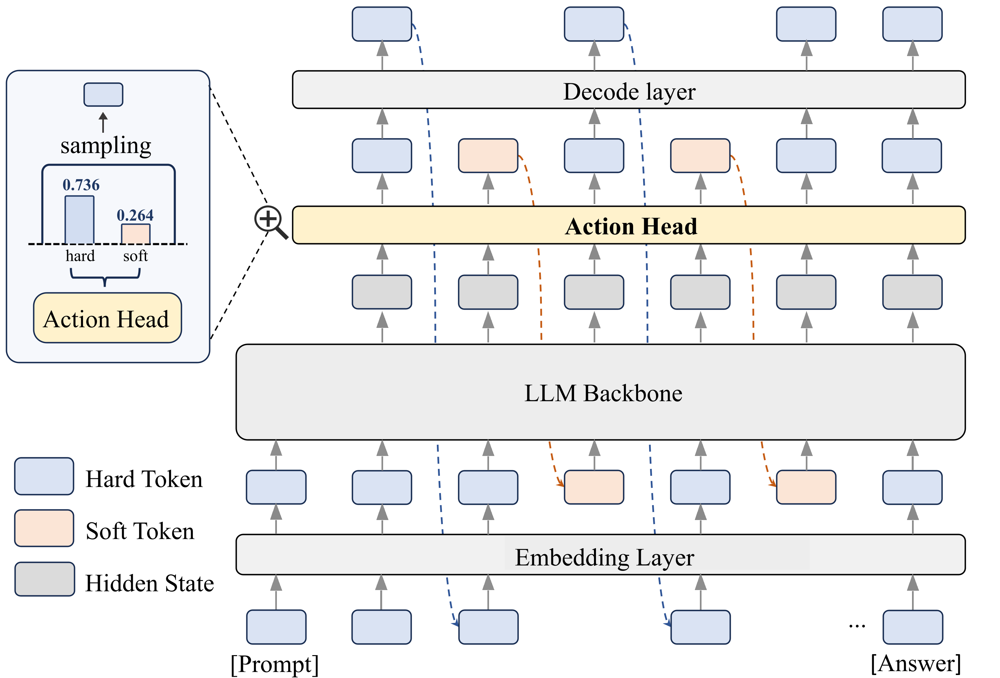
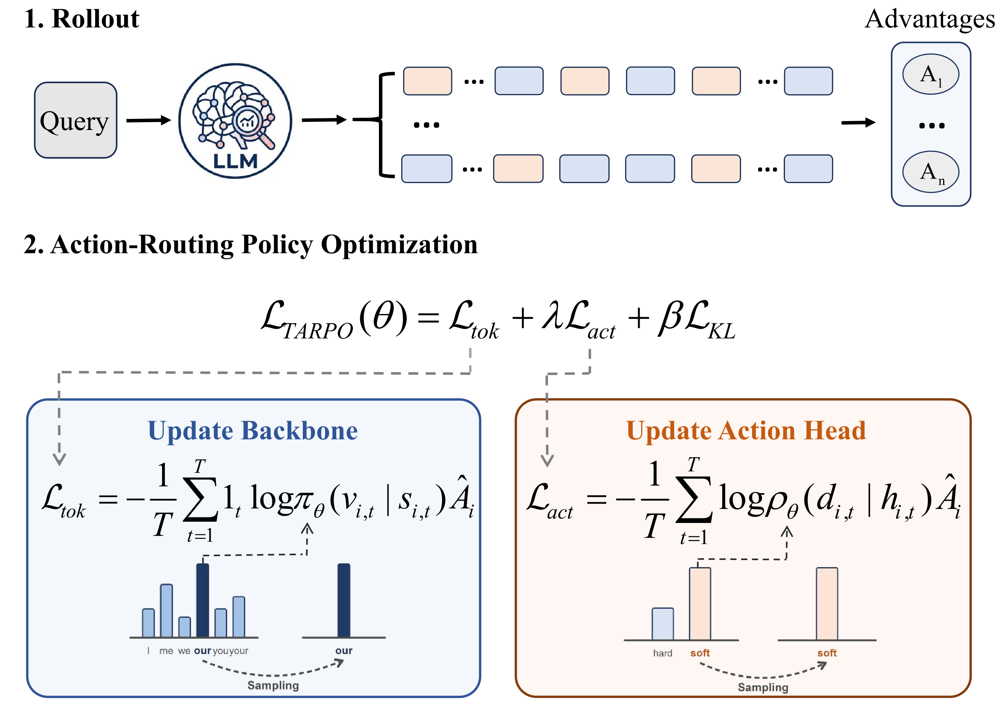

# TARPO: Token-Wise Latent-Explicit Reasoning via Action-Routing Policy Optimization

<p align="center">
  <a href="https://github.com/NKU-LITI/TARPO-master">
    
  </a>
  <a href="https://arxiv.org/pdf/2606.05859">
    
  </a>
  <a href="https://github.com/NKU-LITI/TARPO-master.git">
    
  </a>
</p>

---

## 💡 Introduction

Latent reasoning has emerged as a promising alternative to discrete Chain-of-Thought (CoT) in large language models (LLMs), enabling more expressive reasoning by operating over continuous representations. However, the inherently deterministic nature of continuous representations limits policy exploration in reinforcement learning (RL).

To address this, we propose **TARPO** (Token-Wise Latent-Explicit Reasoning via Action-Routing Policy Optimization), a pure RL framework that adaptively switches between discrete token generation and continuous latent reasoning at each step. TARPO introduces a lightweight **action head router** that observes the current hidden state and samples a routing decision from a binary mode-selection space, preserving the stochasticity of discrete token sampling from the vocabulary. The LLM backbone and router are jointly optimized end-to-end with a shared group-relative advantage signal.


## 🖼️ Overview

<!-- **TARPO** is a pure reinforcement learning framework that adaptively switches between discrete token generation and continuous latent reasoning at each step. By introducing a lightweight action head router, it overcomes the deterministic bottleneck of continuous representations and preserves policy exploration stochasticity, jointly optimizing the LLM backbone and router end-to-end to consistently outperform existing RL baselines. -->

<p align="center">
  
  
</p>
<p align="left">
  <em>Figure 1: Overview of the TARPO framework. (a) During reasoning, a lightweight Action Head receives the current hidden state and routes the next step to either discrete token generation (hard) or continuous latent reasoning (soft). (b) The framework is trained end-to-end with a shared group-relative advantage signal, which jointly updates the LLM backbone and the action head from sampled hybrid rollouts.</em>
</p>


## 🛠️ Installation

Our training framework is adapted from [HRPO](https://github.com/Yueeeeeeee/HRPO.git). To support our token-wise action-routing mechanism, we utilize adapted versions of `transformers`, `trl`, and `unsloth`, which are included as local directories in this repository. 

We recommend using Anaconda/Miniconda to manage your environment (Python 3.10+ is recommended).

```bash
# 1. Clone the repository
git clone [https://github.com/NKU-LITI/TARPO-master.git](https://github.com/NKU-LITI/TARPO-master)
cd TARPO-master

# 2. Create and activate a Conda environment
conda create -n tarpo python=3.10 -y
conda activate tarpo

# 3. Install the standard dependencies
pip install -r requirements.txt
```


## 🚀 Training

To train the TARPO model on the MATH dataset, run the following command. The action bias is initialized to prioritize hard token generation slightly, as described in the methodology.

```bash
python tarpo_math.py \
    --model_name Qwen/Qwen2.5-3B-Instruct \
    --group_size 8 \
    --gradient_accumulation_steps 1 \
    --per_device_train_batch_size 64 \
    --action_bias 2.2 0.0
```

**Key arguments:**
- `--model_name`: Directory or name of the HuggingFace model.
- `--group_size`: Number of candidate responses sampled per query.
- `--action_bias`: Initial bias for the action head (`b0`). We use `[4.6, 0.0]` for 1.5B/7B models and `[2.2, 0.0]` for 3B models on MATH. The default `[4.6, 0.0]` mildly favors hard token generation at initialization.
- `--per_device_train_batch_size`: Per-device batch size.
- `--gradient_accumulation_steps`: Gradient accumulation steps.


## 📊 Evaluation

To evaluate the trained TARPO model on the MATH benchmark, use the following command. Please ensure you replace `${EXP_PATH}` with the actual path to your saved model checkpoints.

```bash
CUDA_VISIBLE_DEVICES=6 python eval_tarpo_math_avg.py \
  --checkpoint_path "${EXP_PATH}" \
  --batch_size 2 \
  --k 32
```

**Key arguments:**
- `--checkpoint_path`: Path to the model checkpoint.
- `--batch_size`: (Optional) Batch size for evaluation.
- `--k`: Number of sampled generations for Pass@k evaluation (default: 32).


All evaluation outputs — including metrics and generated examples — will be written to the specified `checkpoint_path` directory.


## 📈 Main Results

TARPO is evaluated on Qwen2.5 (1.5B / 3B / 7B) and Llama-3.1-8B backbones. Below are selected highlights (Pass@1 / Pass@32 averaged over GSM8K, MATH, MATH500, AMC23, OlympiadBench):

| Method | Qwen2.5-1.5B Avg P@1 | Qwen2.5-3B Avg P@1 | Qwen2.5-7B Avg P@1 |
|--------|----------------------|---------------------|---------------------|
| CoT | 31.45 | 48.89 | 56.12 |
| GRPO | 41.73 | 53.10 | 62.49 |
| HRPO | 42.16 | 53.20 | 62.42 |
| **TARPO (Ours)** | **42.36** | **53.61** | **62.92** |

TARPO also achieves the best OOD average Pass@1 of **55.35%** on Qwen2.5-3B (GPQA-Diamond, ARC-C, HumanEval) while reducing average generated tokens to **337.9** vs. 400+ for baseline RL methods.


## 🙏 Acknowledgements

This codebase is heavily built upon the excellent [HRPO](https://github.com/Yueeeeeeee/HRPO.git) framework. We sincerely thank the authors for open-sourcing their codebase and contributing to the latent reasoning community. 

If you find our TARPO framework useful, please also consider citing their foundational work:

```bibtex
@article{yue2025hybrid,
  title={Hybrid Latent Reasoning via Reinforcement Learning},
  author={Yue, Zhenrui and Jin, Bowen and Zeng, Huimin and Zhuang, Honglei and Qin, Zhen and Yoon, Jinsung and Shang, Lanyu and Han, Jiawei and Wang, Dong},
  journal={arXiv preprint arXiv:2505.18454},
  year={2025}
} 
```


## 📝 Citation

If you find TARPO useful in your research, please consider citing our paper:

```bibtex
@misc{zhang2026tarpotokenwiselatentexplicitreasoning,
      title={TARPO: Token-Wise Latent-Explicit Reasoning via Action-Routing Policy Optimization}, 
      author={Liting Zhang and Shiwan Zhao and Xuyang Zhao and Zichen Xu and Jianye Wang and Qicheng Li},
      year={2026},
      eprint={2606.05859},
      archivePrefix={arXiv},
      primaryClass={cs.CL},
      url={https://arxiv.org/abs/2606.05859}, 
}
```